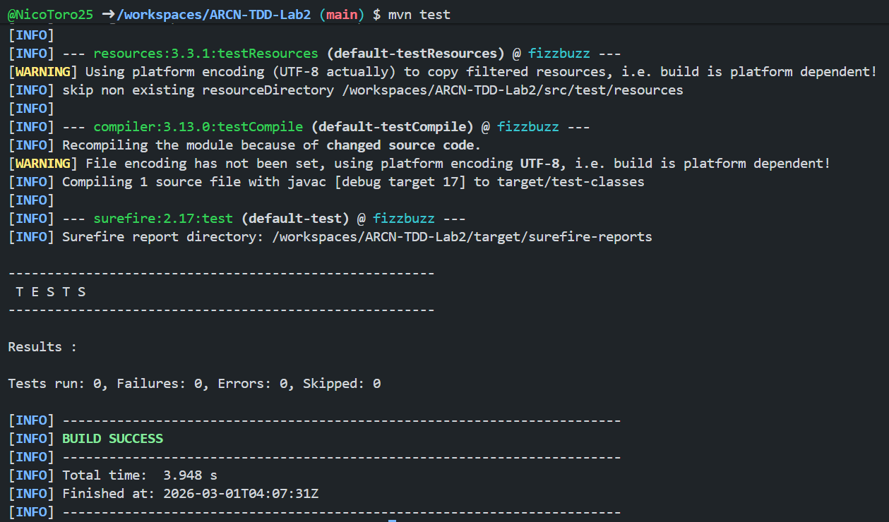
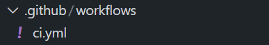
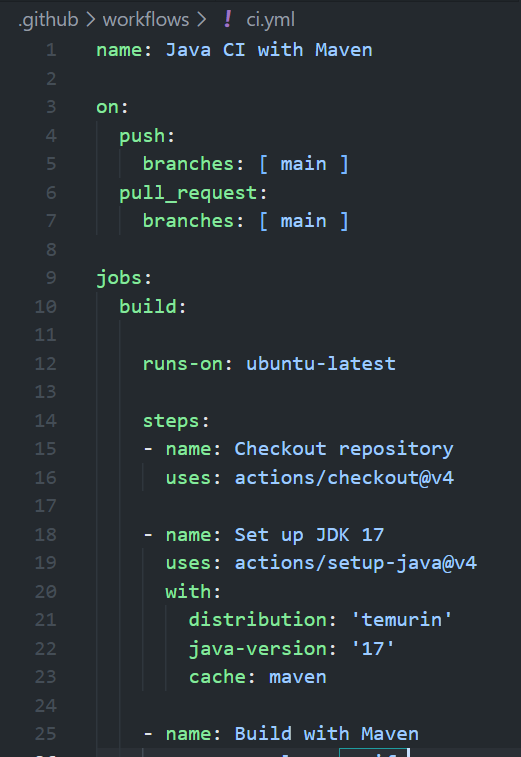

# Laboratorio TDD con FizzBuzz  - Laboratorio #2

## Arquitectura Centrada en el Negocio (ARCN)

## Nicolás Toro Criollo

En este repositorio se busca solución el laboratorio propuesto en el link [TDD](https://eci-arcn.github.io/Labs/tdd/)
que tiene como objetivo que los estudiantes refactoricen código que viola los principios SOLID y apliquen las mejores prácticas.

---

## Requisitos Previos
- Java 17+
- Maven
- GitHub Codespaces
- JUnit 5 para pruebas

---

## Estructura general del proyecto

```bash
.
├── images
│   ├── mvnTest.png
│   └── repo.png
├── pom.xml
├── README.md
├── src
│   ├── main
│   │   └── java
│   │       └── FizzBuzz.java
│   └── test
│       └── java
│           └── FizzBuzzTest.java
└── target
    ├── classes
    │   └── FizzBuzz.class
    ├── generated-sources
    │   └── annotations
    ├── generated-test-sources
    │   └── test-annotations
    ├── maven-status
    │   └── maven-compiler-plugin
    │       ├── compile
    │       │   └── default-compile
    │       │       ├── createdFiles.lst
    │       │       └── inputFiles.lst
    │       └── testCompile
    │           └── default-testCompile
    │               ├── createdFiles.lst
    │               └── inputFiles.lst
    └── test-classes
        └── FizzBuzzTest.class
```

---


## Creación del repositorio y configuración del entorno

Se creó el README.md y se configuró adecuadamente el entorno para que pueda funcionar correctamente:


---

## Implementación

Se crearon las pruebas correspondientes siguiendo la metodología de Desarrollo Guiado por Pruebas (TDD), se puede encontrar la implementación en FizzBuzz.java y FizzBuzzTest.java.



---

## Refactorización

Se refactorizó el código con el propósito de que se más legible.

---

## Pipeline CI/CD

Se creó el directorio .github/workflows que contenga información para hacer un correcto CI.





