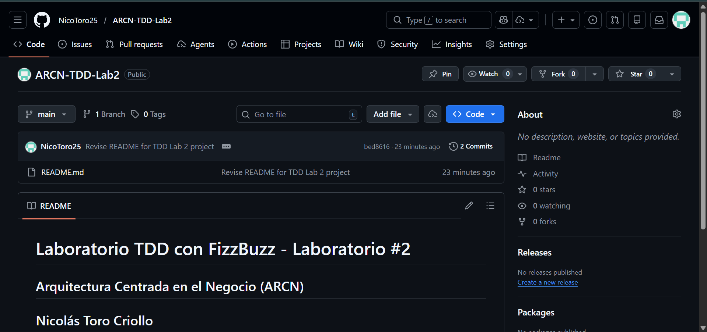
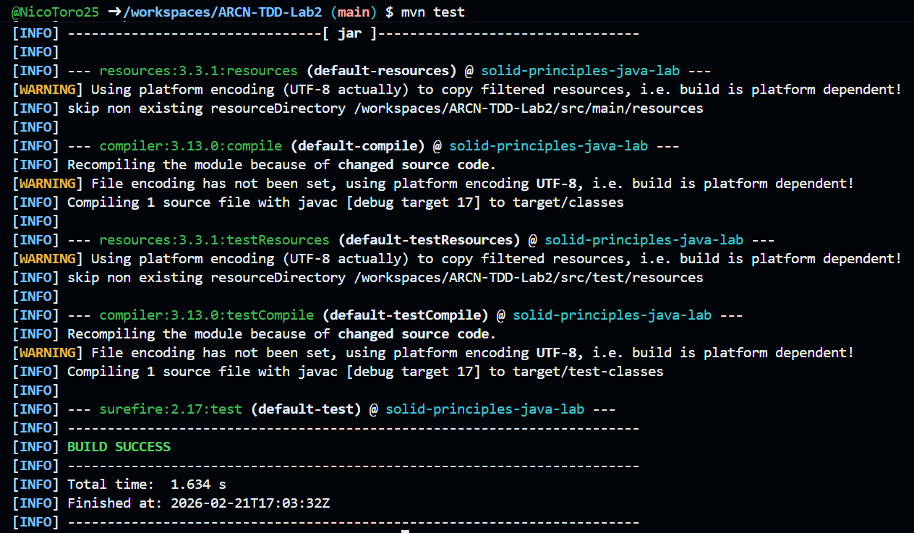

# Laboratorio TDD con FizzBuzz  - Laboratorio #2

## Arquitectura Centrada en el Negocio (ARCN)

## Nicolás Toro Criollo

En este repositorio se busca solución el laboratorio propuesto en el link [TDD](https://eci-arcn.github.io/Labs/tdd/)
que tiene como objetivo que los estudiantes refactoricen código que viola los principios SOLID y apliquen las mejores prácticas.

---

## Requisitos Previos
- Java 17+
- Maven
- GitHub Codespaces
- JUnit 5 para pruebas

---

## Creación del repositorio y configuración del entorno

Se creó el README.md y se configuró adecuadamente el entorno para que pueda funcionar correctamente:

---

## Paso 1: Escribir la primera prueba

